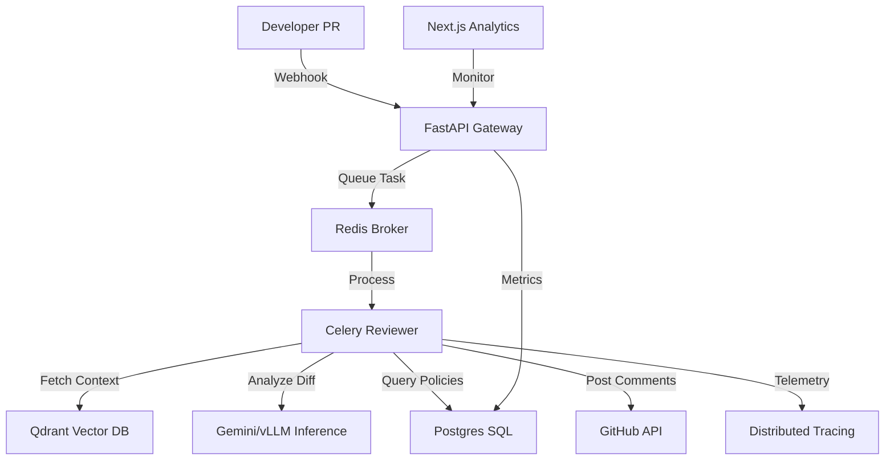
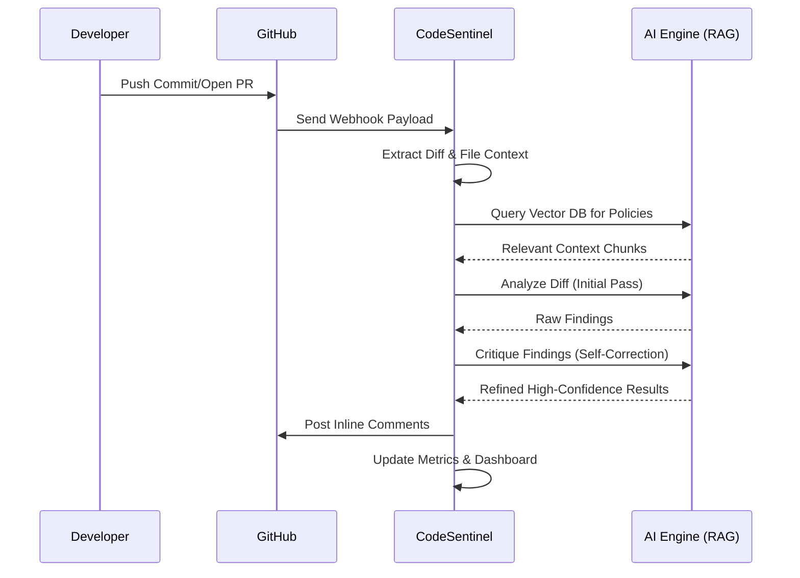

# 🛡️ CodeSentinel: AI-Native Autonomous Code Reviewer

[](#-tech-stack)
[](#-architecture)
[](LICENSE)

**CodeSentinel** is a production-grade, asynchronous code review platform that leverages Large Language Models (LLMs) and Retrieval-Augmented Generation (RAG) to provide human-like critiques on GitHub Pull Requests. It goes beyond simple linting by understanding architectural patterns, identifying security vulnerabilities (SQLi, SSRF, etc.), and suggesting optimized remediations.

---

## 📖 Executive Summary
In modern software development, PR reviews are often the primary bottleneck. CodeSentinel automates the "first pass" of reviews. It intercepts GitHub webhooks, processes the diff through a sophisticated multi-stage AI pipeline, and provides actionable, context-aware feedback directly on the PR. 

### Key Capabilities:
- **Asynchronous Processing**: Uses Celery and Redis to handle high-traffic PR bursts without blocking.
- **Context-Aware Reviews (RAG)**: Queries a Qdrant vector database to understand project-specific policies and documentation before reviewing.
- **Self-Correction Logic**: Features a unique "Critic" agent that re-evaluates initial findings to minimize false positives.
- **Real-time Insights**: A high-fidelity dashboard built with Next.js 16 and Recharts for visualizing repository health and reviewer performance.

---

## 🏗️ System Architecture
CodeSentinel is built on a distributed microservices architecture designed for durability and high throughput.



### The "Deep Review" Flow


---

## 🚀 Unique Features
### 1. The Multi-Stage Critique Pipeline
Most AI reviewers hallucinate. CodeSentinel implements a **Self-Refining Loop**:
1. **Analyze**: The model identifies potential issues in a diff chunk.
2. **Critique**: A second pass specifically looks for "False Positives" or "Nitpicks" to ensure the developer only sees high-value comments.

### 3. Semantic Search (RAG)
By indexing your project's `CONTRIBUTING.md` and security policies into **Qdrant**, CodeSentinel "reads the room" before it speaks. It won't suggest a pattern that contradicts your team's specific coding standards.

### 4. Distributed Observability
Integrated with **Jaeger**, every review task is traced across services. This allows SREs to identify exactly where latency occurs—whether it's the GitHub API, Vector retrieval, or LLM inference.

---

## 🛠️ Tech Stack
| Layer | Technology |
| :--- | :--- |
| **Frontend** | Next.js 16 (App Router), Tailwind CSS v4, Framer Motion, Recharts |
| **Backend API** | FastAPI (Python 3.12), Pydantic v2 |
| **Task Queue** | Celery & Redis |
| **Databases** | PostgreSQL (Relational), Qdrant (Vector/Semantic) |
| **AI/ML** | Gemini API / vLLM, Langfuse (Tracing), Structlog |
| **Infrastructure** | Docker, Docker Compose, Alembic (Migrations) |

---

## 💡 What I Learnt
Building CodeSentinel was a deep dive into **Enterprise AI System Design**:
- **Async Systems**: I mastered the `Producer-Consumer` pattern using Celery to ensure that slow LLM responses don't affect system availability.
- **RAG Implementation**: Implementing vector similarity search taught me how to bridge the gap between static LLM knowledge and dynamic codebase context.
- **Database Scalability**: Designing a schema that handles both relational metadata (Postgres) and high-dimensional vectors (Qdrant).
- **Industrial-Grade Logging**: Transitioning from basic prints to structured logging and distributed tracing (Jaeger) for production debugging.
- **UI/UX for Developers**: Using Recharts and Framer Motion to build an analytics dashboard that isn't just "functional" but "premium."

---

## 💼 Business & Professional Utility
- **For Software Developers**: Focus on creative problem-solving while the AI handles the repetitive linting and basic security checks.
- **For Leads/Managers**: Gain clear insights into "Problematic Files" or "Churned Modules" via the analytics dashboard to optimize sprint planning.
- **For DevSecOps**: Automatically block merges if critical vulnerabilities (like Hardcoded Secrets) are detected, ensuring a "Shift-Left" security posture.
- **Scalability**: Designed to be deployed on Kubernetes; the task workers can scale horizontally based on the number of open PRs in an organization.

---

## 📥 Getting Started

### Prerequisites
- Docker & Docker Compose
- GitHub Personal Access Token (PAT)
- Google AI (Gemini) API Key

### Installation
1. **Clone the repository**:
   ```bash
   git clone https://github.com/yourusername/CodeSentinel.git
   cd CodeSentinel
   ```
2. **Configure Environment**:
   Copy the example environment files and fill in your keys:
   ```bash
   cp .env.example .env
   cp backend/.env.example backend/.env
   ```
3. **Spin up the stack**:
   ```bash
   docker-compose up --build
   ```
4. **Access the platform**:
   - **Dashboard**: `http://localhost:3000`
   - **API Docs**: `http://localhost:8000/docs`
   - **Jaeger UI**: `http://localhost:16686`

---

---

## 📂 Project Structure
```text
CodeSentinel/
├── backend/                # FastAPI Core & Celery Workers
│   ├── app/
│   │   ├── api/            # Route handlers
│   │   ├── services/       # AI, RAG, GitHub Logic
│   │   ├── models/         # SQLAlchemy Schemas
│   │   └── tasks/          # Celery Async Tasks
│   └── tests/              # Pytest Suite
├── frontend/               # Next.js 16 Dashboard
│   ├── app/                # App Router (Pages)
│   ├── components/         # Shadcn/UI & Custom Components
│   └── lib/                # Utils & Hooks
├── infra/                  # Qdrant & Postgres Configs
├── docker-compose.yml      # Multi-container Orchestration
└── .env.example            # Environment Template
```

---
